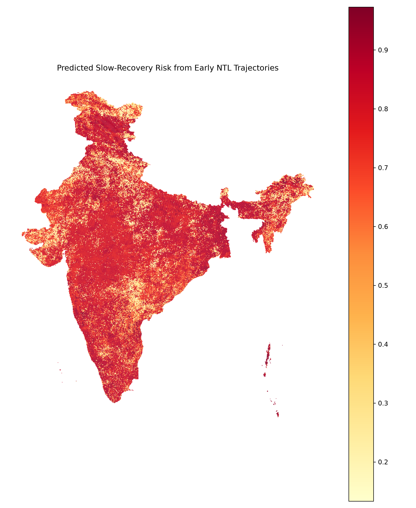
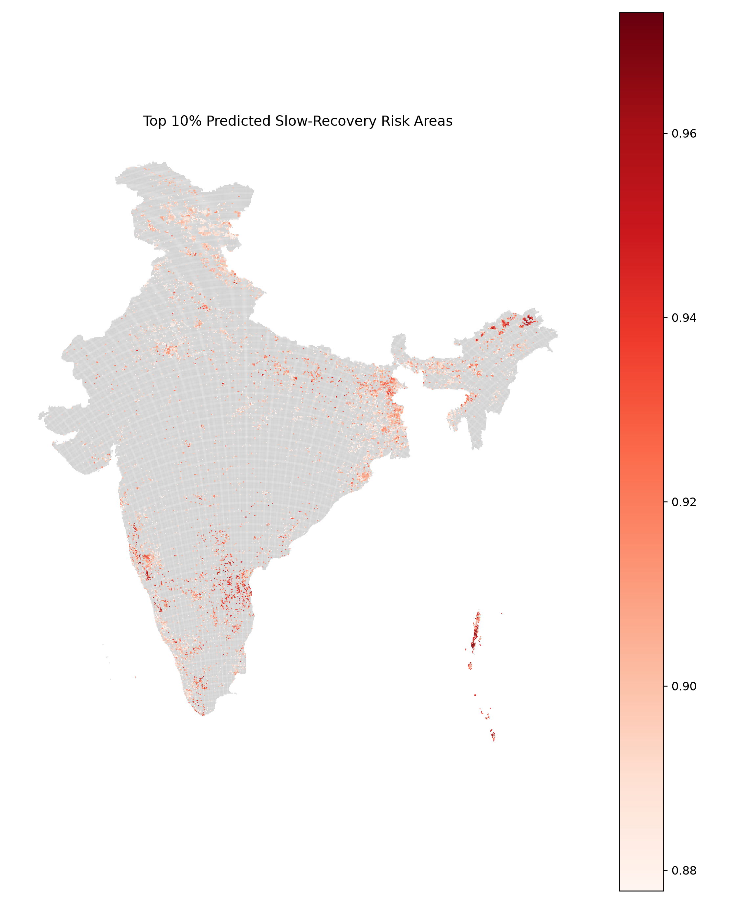
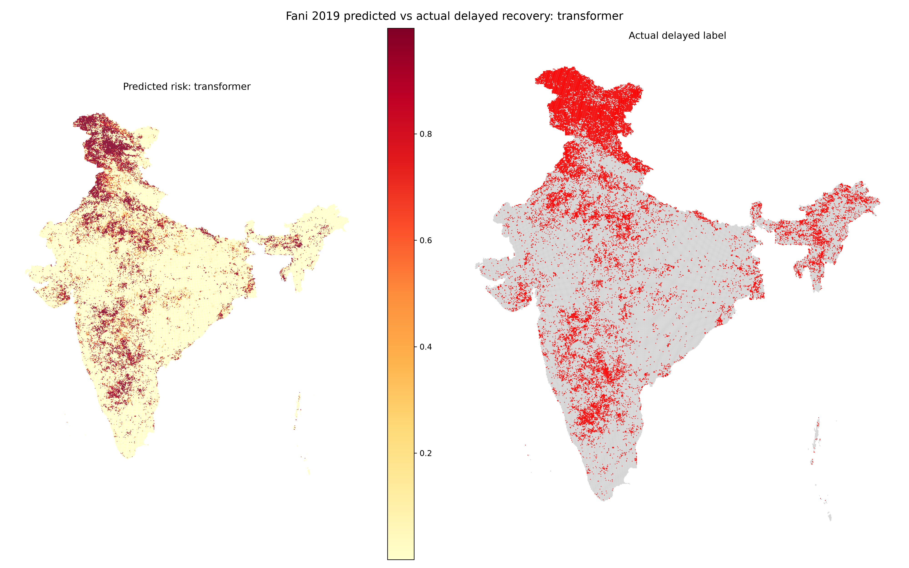
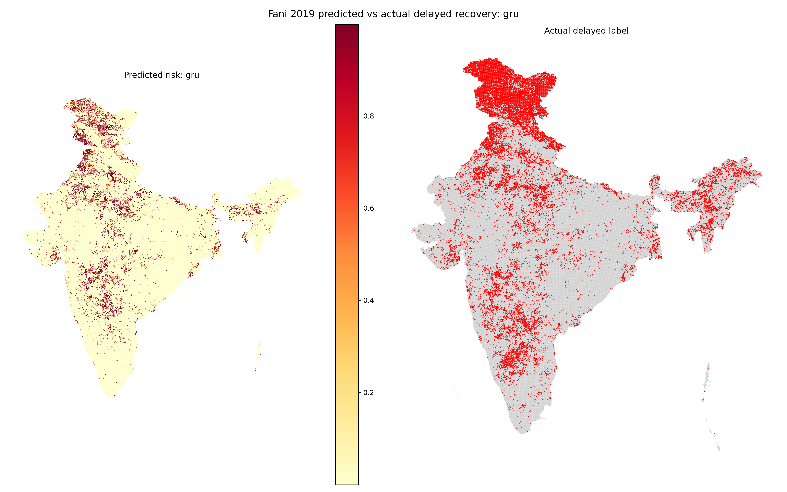
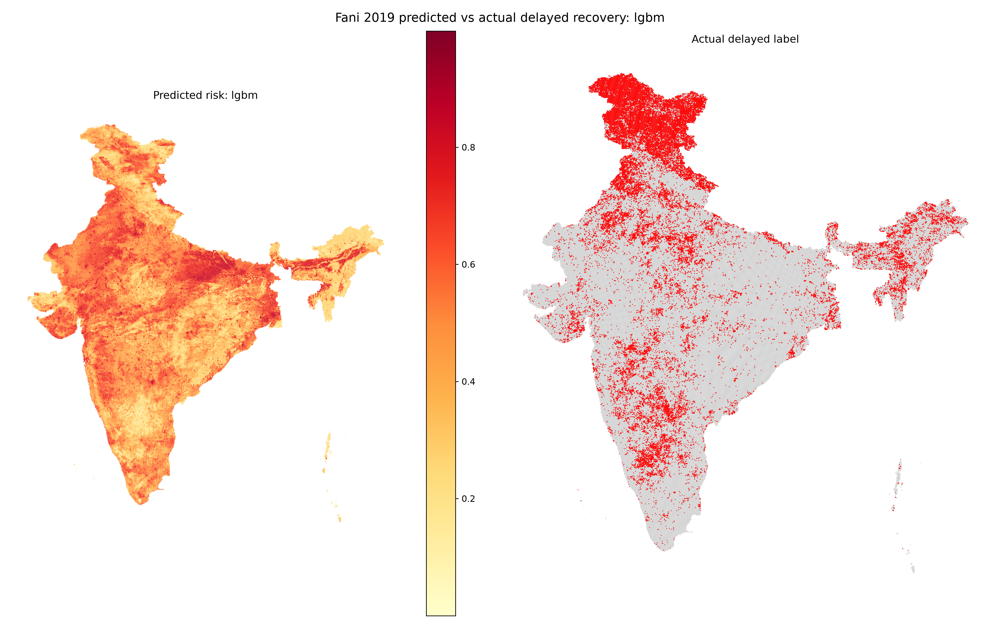
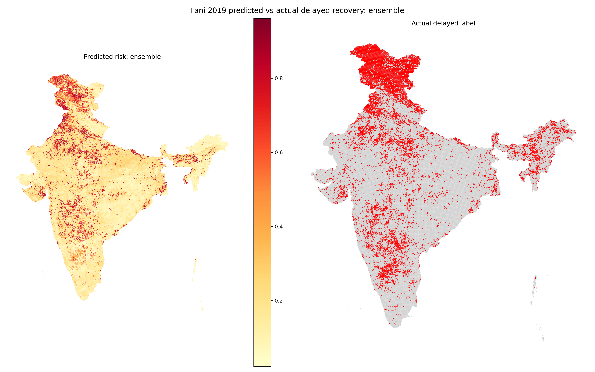

# Polarization of Post-Disaster Resilience Analysis Using NTL Time-Series Data

This project quantifies **post-disaster recovery polarization** in India using grid-level nighttime lights time-series data.

Core interpretation:

> This is not a framework for claiming that AI precisely predicts exact disaster recovery duration.  
> It is a framework for quantifying recovery polarization and identifying delayed-recovery risk areas using early NTL recovery patterns and spatial/socioeconomic/hazard exposure features.

## 1. Final research scope

- Country: India
- Disaster types: tropical cyclones + urban flooding
- Primary data: NASA Black Marble VNP46A2 nighttime lights time series
- Sample unit: `event_id × grid_id`
- Main target: event-relative delayed recovery classification
- Auxiliary target: event-relative recovery delay percentile
- Additional targets: no recovery within 12/24 months
- Primary validation: Leave-One-Event-Out validation
- Main early-prediction setting: **pre-12 months + event month + post-3 months**
- Final single-model interpretation: **Transformer multi-task sequence model**
- Additional sequence models: **TCN** and **GRU**
- Baseline model: **LightGBM tabular baseline**
- Combined output: **ensemble prediction**, used as a robustness/combined-risk result rather than a separate trained checkpoint

## 2. What the trained model predicts

The trained model predicts **grid-level delayed-recovery risk** for a disaster event.

For each sample:

```text
sample = event_id × grid_id
```

The early-3-month sequence input uses:

```text
pre-12 months + event month + post-3 months = 16 monthly time steps
```

The processed sequence tensor used in the final early-3 setting had this structure:

```text
X_seq_early3: samples × 16 time steps × 6 sequence features
```

The model also uses tabular/static/event-level features after preprocessing.

The main output is:

```text
pred_delayed_prob
```

This is a 0–1 risk score for delayed recovery.

Interpretation:

```text
0.10 = low predicted delayed-recovery risk
0.50 = moderate predicted delayed-recovery risk
0.90 = high predicted delayed-recovery risk
```

However, this value should be interpreted as a **model risk score** or **probability-like screening score**, not as an exact real-world probability.  
The most reliable use is **ranking grids by relative risk** and identifying high-risk areas for monitoring.

## 3. Definition of actual delayed recovery

The main binary target is:

```text
y_delayed_slowest_20pct
```

This target is event-relative.

For each disaster event:

```text
1. Compute recovery-delay behavior for all grids in that event.
2. Rank grids by delayed recovery.
3. Label the slowest-recovering 20% as delayed recovery = 1.
4. Label the remaining grids as delayed recovery = 0.
```

Therefore, the model is not predicting a universal fixed duration threshold.  
It is predicting whether a grid belongs to the **slowest-recovering group within the same disaster event**.

## 4. Probability score, rank, and risk interpretation

The model output is a probability-like score:

```text
pred_delayed_prob ∈ [0, 1]
```

Ranking is obtained by sorting this score:

```text
higher pred_delayed_prob → higher delayed-recovery risk rank
```

For example:

```text
grid A: 0.93
grid B: 0.72
grid C: 0.25
```

Risk ranking:

```text
A > B > C
```

Thus:

- The model output is a **risk score**.
- The spatial prioritization result is a **ranked list of grids**.
- Top-k metrics evaluate whether the highest-risk ranked grids contain the actual delayed-recovery grids.

## 5. Leave-One-Event-Out validation

The project uses Leave-One-Event-Out validation.

With seven disaster events, the validation process is:

```text
Fold 1: train on 6 events, test on the held-out event
Fold 2: train on another set of 6 events, test on another held-out event
...
Fold 7: repeat until every event has been used as the test event once
```

This means the model is evaluated on disaster events that were held out from training.

A precise interpretation is:

> For each held-out disaster event, the model predicts grid-level delayed-recovery risk from early NTL trajectories, and the predictions are compared with the event-specific observed delayed-recovery labels.

## 6. Final model performance

| Model | Delayed AUROC | Delayed AUPRC | Delayed F1 | Delayed Recall | Top-30% Recall | Percentile MAE | Percentile RMSE | Percentile Spearman |
|---|---:|---:|---:|---:|---:|---:|---:|---:|
| Ensemble | 0.9174 | 0.7262 | 0.7739 | 0.8620 | 0.9241 | 0.1008 | 0.1358 | 0.4805 |
| GRU | 0.8994 | 0.6058 | 0.7816 | 0.8318 | 0.9042 | 0.0957 | 0.1507 | 0.4028 |
| LightGBM | 0.5018 | 0.1829 | 0.2593 | 0.3929 | 0.3137 | 0.1838 | 0.2251 | 0.0587 |
| TCN | 0.9198 | 0.6670 | 0.7695 | 0.8374 | 0.9168 | 0.0899 | 0.1380 | 0.4739 |
| Transformer | 0.9264 | 0.7369 | 0.7752 | 0.9019 | 0.9324 | 0.1036 | 0.1440 | 0.4369 |

Interpretation:

- Transformer achieved the strongest delayed-recovery discrimination by AUROC/AUPRC.
- GRU achieved the strongest delayed-recovery F1.
- TCN was strong in recovery-percentile prediction and long-term non-recovery ranking.
- LightGBM performed close to random for delayed-recovery AUROC, indicating that static/tabular features alone were not sufficient.
- Sequence-based models substantially outperformed the tabular baseline, suggesting that early NTL temporal dynamics contain key recovery information.

## 7. Metric definitions

### Precision

Among grids predicted as delayed recovery, the fraction that were actually delayed recovery.

### Recall

Among actual delayed-recovery grids, the fraction detected by the model.

### F1 score

The harmonic mean of precision and recall.

### Balanced accuracy

Average of sensitivity and specificity. It is more reliable than plain accuracy when classes are imbalanced.

### AUROC

Measures how well the model ranks actual delayed-recovery grids above non-delayed grids.

```text
0.5 = random ranking
1.0 = perfect ranking
```

### AUPRC

Area under the precision-recall curve. This is especially important when the positive class is rare.

### Top-20% recall / Top-30% recall

The model ranks all grids by `pred_delayed_prob`.

Top-k recall measures:

```text
How many actual delayed-recovery grids are captured within the top 20% or top 30% highest-risk grids?
```

This is important for disaster monitoring because decision-makers often prioritize the highest-risk areas.

### MAE

Mean absolute error for `recovery_delay_percentile`. Lower is better.

### RMSE

Root mean squared error for `recovery_delay_percentile`. Lower is better and large errors are penalized more strongly.

### Spearman correlation

Measures whether the predicted recovery-delay ranking is similar to the actual recovery-delay ranking. Higher is better.

## 8. Long-term no-recovery targets

Additional targets:

```text
y_no_recovery_12m
y_no_recovery_24m
```

These labels were extremely imbalanced.

Therefore:

- Threshold-based precision/recall/F1 can be unstable or zero.
- AUROC, AUPRC, and top-risk ranking are more appropriate.
- These targets should be reported as supplementary long-term risk indicators, not as the main claim.

## 9. Spatial risk-map interpretation

Final map files:

```text
outputs/maps/slow_recovery_risk_map.geojson
outputs/maps/slow_recovery_risk_map.gpkg
outputs/maps/slow_recovery_risk_map_with_centroid.csv
outputs/maps/slow_recovery_risk_grid_aggregated.geojson
```

Final figure files:

```text
outputs/figures/map_predicted_slow_recovery_risk.png
outputs/figures/map_top10_slow_recovery_risk.png
```

### Aggregated risk map



The aggregated map uses:

```text
map_risk(grid) = max(pred_delayed_prob across evaluated events for that grid)
```

Therefore, red intensity is **not the sum of all event risks**.  
It represents the maximum predicted delayed-recovery risk observed for that grid across the evaluated events.

Interpretation:

> A darker red grid means that the grid had high predicted delayed-recovery risk in at least one evaluated disaster event.

### Top 10% high-risk map



This map highlights the top 10% of grids by aggregated predicted risk.

## 10. Event-level predicted vs actual maps

For more interpretable spatial validation, generate event-specific maps.

For each model and event, compare:

```text
Predicted map:
pred_delayed_prob

Actual map:
y_delayed_slowest_20pct
```

For the Fani event, the recommended outputs are:

```text
outputs/figures/event_model_compare/fani/transformer_fani_predicted_risk.png
outputs/figures/event_model_compare/fani/transformer_fani_actual_delayed.png
outputs/figures/event_model_compare/fani/gru_fani_predicted_risk.png
outputs/figures/event_model_compare/fani/gru_fani_actual_delayed.png
outputs/figures/event_model_compare/fani/tcn_fani_predicted_risk.png
outputs/figures/event_model_compare/fani/tcn_fani_actual_delayed.png
outputs/figures/event_model_compare/fani/lgbm_fani_predicted_risk.png
outputs/figures/event_model_compare/fani/lgbm_fani_actual_delayed.png
```

The actual map is identical across models because the ground-truth label does not depend on the model.  
The predicted map differs by model.


## Fani 2019 model-level predicted vs actual map comparison

This section compares the spatial prediction patterns for the Fani 2019 held-out event.

For each model, the left panel shows:

```text
pred_delayed_prob
```

The right panel shows:

```text
y_delayed_slowest_20pct
```

The actual delayed-recovery label is the same across models because it is the observed target.  
The predicted risk map differs by model.

### Fani map summary

| model       | event_keyword   |   mapped_grids |   actual_delayed_rate |   pred_delayed_prob_mean |   pred_delayed_prob_p90 |   pred_delayed_prob_min |   pred_delayed_prob_max |
|:------------|:----------------|---------------:|----------------------:|-------------------------:|------------------------:|------------------------:|------------------------:|
| transformer | fani            |         127284 |              0.211354 |                 0.166977 |                0.922348 |                4.4e-05  |                0.999821 |
| gru         | fani            |         127284 |              0.211354 |                 0.103009 |                0.523716 |                0        |                0.999921 |
| tcn         | fani            |         127284 |              0.211354 |                 0.10756  |                0.522813 |                0        |                1        |
| lgbm        | fani            |         127284 |              0.211354 |                 0.480512 |                0.677845 |                0.065909 |                0.903892 |
| ensemble    | fani            |         127284 |              0.211354 |                 0.251683 |                0.615075 |                0.022427 |                0.961474 |

Interpretation:

- Transformer, GRU, TCN, and ensemble produce sparse high-risk patterns that can be compared against the actual delayed-recovery label.
- LightGBM produces a smoother and less discriminative spatial pattern, consistent with its weaker delayed-recovery AUROC.
- The ensemble map combines model predictions and should be interpreted as a robustness-oriented combined risk layer, not as a separate trained checkpoint.
- Darker predicted areas indicate higher `pred_delayed_prob`, while red areas in the actual map indicate grids labeled as delayed recovery.

### Transformer



### GRU



### TCN


### LightGBM



### Ensemble



## 11. Generated model files

Deep learning models are stored as PyTorch checkpoints:

```text
outputs/models/tcn/tcn_<event_id>_early3.pt
outputs/models/gru/gru_<event_id>_early3.pt
outputs/models/transformer/transformer_<event_id>_early3.pt
```

LightGBM baseline models are stored as joblib files:

```text
outputs/models/lgbm/lgbm_<event_id>.joblib
```

Prediction files are stored separately:

```text
outputs/predictions/tcn_early3_predictions.parquet
outputs/predictions/gru_early3_predictions.parquet
outputs/predictions/transformer_early3_predictions.parquet
outputs/predictions/lgbm_predictions.parquet
outputs/predictions/ensemble_predictions.parquet
```

Important distinction:

```text
Model checkpoint files: .pt / .joblib
Prediction result files: .parquet / .csv
Map outputs: .geojson / .gpkg / .png
```

## 12. Full execution order

```bash
python scripts/00_init_project.py
python scripts/01_build_event_catalog.py
python scripts/02_make_grid.py
python scripts/03_ingest_ntl.py
python scripts/04_build_grid_event_ntl_sequences.py
python scripts/05_make_recovery_metrics.py
python scripts/06_make_targets.py
python scripts/07_make_hazard_features.py
python scripts/08_make_socioeconomic_features.py
python scripts/09_build_modeling_dataset.py
python scripts/10_make_splits.py
python scripts/11_check_leakage.py
python scripts/20_train_lgbm_baseline.py
python scripts/21_train_rf_logistic_baselines.py
python scripts/30_train_tcn_multitask.py
python scripts/31_train_gru_multitask.py
python scripts/32_train_transformer_multitask.py
python scripts/40_ensemble.py
python scripts/50_evaluate_all.py
python scripts/60_make_outputs.py
```

## 13. Leakage rule

The full pre-12 + event + post-24 NTL sequence is allowed only for recovery measurement and target construction.  
Early prediction models must use only pre-12 + event + early post-disaster input windows such as post-3 or post-6.

## 14. Real data extraction additions

The project includes Earth Engine export scripts for the real-data bridge:

```bash
python scripts/70_gee_export_vnp46a2_daily.py --help
python scripts/71_gee_export_gpm_event_rainfall.py --help
python scripts/72_gee_export_ghsl_static_features.py --help
python scripts/73_build_cyclone_hazard_from_ibtracs.py --help
python scripts/74_gee_export_vnp46a2_monthly_optional.py --help
python scripts/80_run_after_raw_downloads.py --help
```

See `REAL_DATA_WORKFLOW.md` for the exact order after uploading the grid to Earth Engine.
